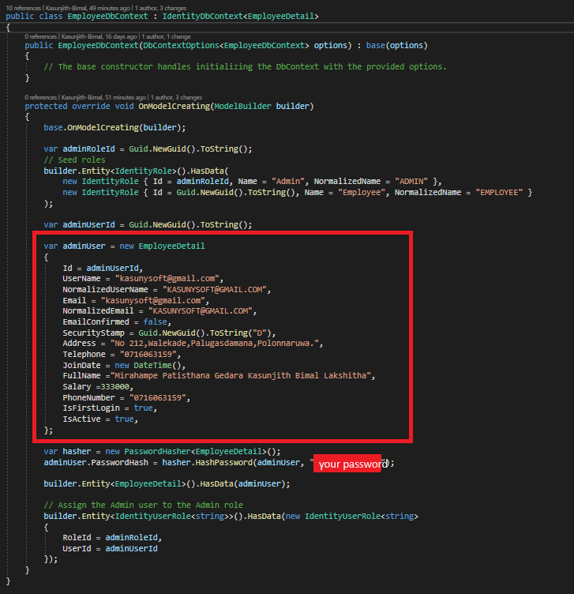
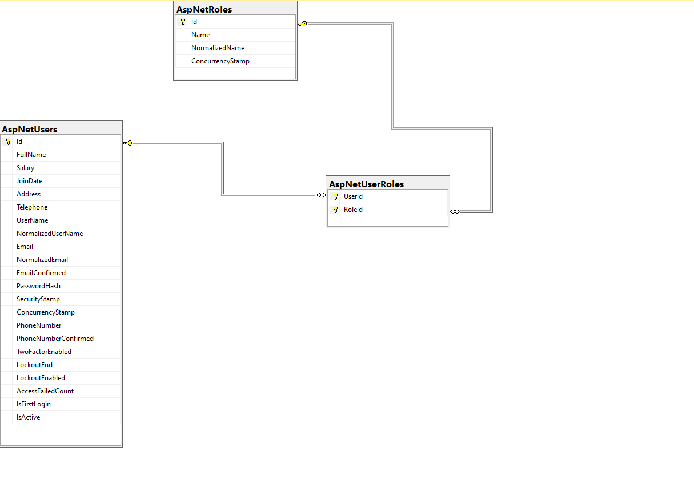

Employee Management System

## Demo Project Video   
[](https://www.youtube.com/watch?v=sTLO9aAVroc)

## Description
Creating a comprehensive web application for managing employee details and monthly salary payments involves a detailed design and development approach. The application requiring robust backend support from ASP.NET CORE WEB API , user-friendly frontend built with Angular.

The objective is to develop a secure and efficient web application that facilitates the management of employee details and their monthly salary payments. The system will feature a dual interface for administrators and employees, ensuring secure access and personalized interactions for each user category. Administrators will have the ability to input and manage employee records, while employees will have access to their personal and salary details, with the flexibility to update specific parts of their profile.
## Features
- Admin and Employee Login: Separate login mechanisms for admins and employees, with security measures in place to handle authentication and authorization effectively.
- Employee Management: Admins can input employee details including full name, email, salary, and join date into the system.
- Automatic Email Notification: Upon adding an employee, the system automatically sends an email with a temporary password, which the employee can later change.
- Profile Updates: Employees can update their profiles with personal details like phone numbers and addresses but cannot change their email, salary, or join date.
- Admins can toggle the active/inactive status of employee profiles, restricting login access to active employees only.
- More features...

## Technology Stack
This project is built using a variety of technologies and patterns to ensure scalability, maintainability, and security. Below is a list of the key technologies and architectural approaches used:

- ASP.NET Core Web API: Serves as the backend framework, providing a robust set of features for building secure and scalable web APIs.
- Angular: Utilized for the frontend development to create a dynamic and responsive user interface.
- SQL Server: The database system of choice, ensuring reliable data storage and management.
- Entity Framework Core: An object-database mapper that enables .NET developers to work with a database using .NET objects, simplifying data access and manipulation.
- Clean Architecture: Ensures that the application is organized in such a way that it's easy to maintain and extend over time, with a clear separation of concerns.
- Repository Patterns: Abstracts the data layer, making the application more maintainable and testable by separating business logic from data access logic.
- CQRS using MassTransit: Implements the Command Query Responsibility Segregation (CQRS) pattern to separate read and update operations for more scalable and maintainable code, with MassTransit facilitating lightweight message-based architecture.
- Angular Auth Guard: Used to protect routes in the Angular application, ensuring that users are authenticated and authorized to access certain pages.
- Token Interceptor: Implements token-based authentication in Angular to securely communicate with the backend API.
- Role-Based Authentication: Enhances security by ensuring users can only access features and data appropriate to their role within the application. This is implemented through the backend ASP.NET Core Web API and integrated with Angular's routing and services to enforce role-based access control (RBAC).
- Lazy Loading in Angular: Improves the performance of the Angular application by splitting it into multiple bundles. These bundles are loaded on demand rather than at the initial load of the application, significantly reducing the initial load time and improving user experience.

## API 
-----------------------------------------------
## Getting Started
### Prerequisites
- .NET Core SDK (Version 6.0.0)
- Entity Framework Core (Version 6.0.0)
- Any other dependencies

### Installation API
1. Clone the repository:
```
 git clone https://github.com/Kasunjith-Bimal/Employee.git
 ```
2. Navigate to the project directory:
 ```
 cd Employee
 ```
3. Navigate API Project 
 ```
 cd API
 ```
4. Navigate Employee Folder And open Employee.sln
5. Right Click Solution File Clean and Rebuild Project  

### Database Setup
To set up and update the database:

1. **change connection string in appsettings.json:**

```
"ConnectionStrings": {
  "DefaultConnection": "Server={{severName}};Database={{databaseName}};Trusted_Connection=True;"
},
```
2. **Change seed data before Add migration :**
  1. ** Change seed data before Add migration **
   ``` 
   Edit EmployeeDbContext.cs class inside data 
   ```
      
   

   if not change EmployeeDbContext.cs you can log system using 
   ```
   Email : kasunysoft@gmail.com
   Password : KasunJith123@
   ```
3. **get package manager console for Employee.Infrastructure class library:** 
  1. **Add a Migration:**
   ```
   Add-Migration {{migrationName}}
   ```
   Replace MigrationName with a descriptive name for your migration.
   
  2. **Update the Database:**
   ```
   update-database
   ```
4. **change appsetting json**
 ```
 "JWT": {
  "ValidAudience": "{your api base url}",
  "ValidIssuer": "{your api base url}",
  "Secret": "ByYM000OLlMQG6VVVp1OH7Xzyr7gHuw1qvUC5dcGt3SNM"
  },
```


### Running the Application
Run Web API application

### API Database Structure 



## UI 
-----------------------------------------------

## Development Setup UI 

### Prerequisites

- Install [Node.js] which includes [Node Package Manager][npm]

### Setting Up a Project

Install the Angular CLI globally:

```
npm install -g @angular/cli
```
## Chnage enviroment.ts and environment.development.ts

```
export const environment = {
    baseUrl:"{{Your API Base Url}}/"
};
```


### Local Development And RUN UI

```bash
# Clone Angular repo
git clone https://github.com/Kasunjith-Bimal/Employee.git

# Navigate to project directory
cd Employee
cd UI
cd employee
# Install dependencies
npm install

# Build and run local dev server
# Note: Initial build will take some time
ng serve 
```


